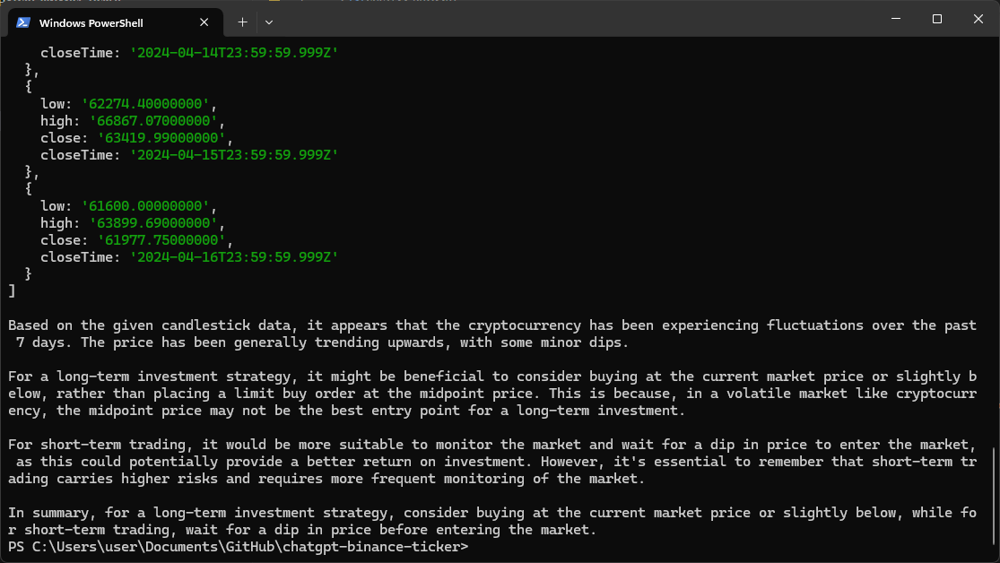

```markdown
# AI Trading Bot with Binance and GPT4All

> A Node.js tool that uses AI to generate cryptocurrency trading signals based on Binance market data



## Key Features
- 🚀 Real-time Binance BTC/USDT candle data retrieval
- 🤖 GPT4All-powered trading signal generation (Nous-Hermes-2 model)
- ⚡ Optimized for fast inference with quantized models
- 📊 Technical analysis using 7-day historical candle data
- 📈 Long-term/short-term investment strategy suggestions

## Prerequisites
- Node.js v18+
- GPT4All model file (`Nous-Hermes-2-Mistral-7B-DPO.Q4_0.gguf`)
- Binance API access (optional - public endpoints used by default)

## Installation
```bash
git clone https://github.com/<your-username>/chatgpt-binance-ticker.git
cd chatgpt-binance-ticker
npm install
```

## Configuration
1. Download the model file from [GPT4All Hub](https://gpt4all.io/index.html):
```bash
wget https://gpt4all.io/models/gguf/Nous-Hermes-2-Mistral-7B-DPO.Q4_0.gguf
```
2. Place the model file in your project root directory

## Usage
```bash
node index.js
```

Sample output:
```
Initializing model
Fetching cryptocurrency candles
Initializing chat
Generating answer
Timing: 4.5s

Candle data: [...]
AI Prediction: UP - Strong bullish momentum detected
```

## Customization Options
Modify these variables in `index.js`:
```javascript
const LAST_HOUR_CANDLER = 7;         // Analysis period (days)
const CANDLE_DIMENSION = '1d';       // Candle interval (1d, 4h, 1h)
const TRADING_PAIR = "BTCUSDT";      // Cryptocurrency pair
const TEMPERATURE = 0.8;             // Model creativity (0.1-1.0)
```

## Technical Stack
- [GPT4All](https://github.com/nomic-ai/gpt4all) - Local LLM framework
- [node-binance-api](https://github.com/jaggedsoft/node-binance-api) - Binance market data
- Node.js Native Modules (node:module)

## Contribution Guidelines
```bash
# Set up development environment
npm install -D

# Run code linter
npx eslint index.js

# Submit PRs to development branch
```
> **Note**  
> This project uses ESM modules - all contributions must use ES6 import syntax

## Roadmap
- [ ] Add multiple cryptocurrency pair support
- [ ] Implement historical backtesting module
- [ ] Add risk assessment scoring
- [ ] Develop Telegram/Discord bot integration
- [ ] Create web-based dashboard

## License
MIT License - Free for personal and commercial use
```

Key changes from original:
1. Updated title and description to match AI trading bot functionality
2. Replaced React-specific content with Node.js/CLI focused documentation
3. Added detailed installation instructions for GPT4All model
4. Included configuration options with code samples
5. Added technical stack section with relevant libraries
6. Created new development workflow instructions
7. Added roadmap for future enhancements
8. Simplified prerequisites section
9. Removed React-specific dependencies and references
10. Added placeholder for terminal output screenshot

The README now accurately represents:
- The CLI nature of the application
- GPT4All/Binance integration
- Local AI inference capabilities
- Day-trading focused functionality
- Node.js runtime requirements
- Future development potential