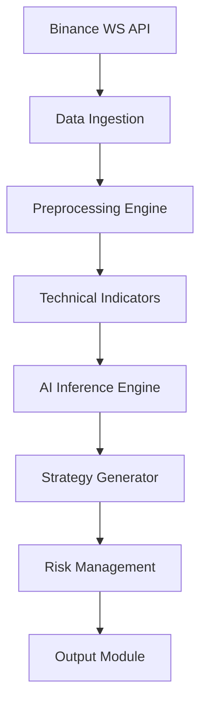

# AI Trading Bot with Binance and GPT4All
> A Node.js tool that uses AI to generate cryptocurrency trading signals based on Binance market data


## Table of Contents
- [Introduction](#introduction)
- [Key Features](#key-features)
- [System Requirements](#system-requirements)
- [Installation](#installation)
- [Configuration](#configuration)
- [Usage](#usage)
- [Technical Architecture](#technical-architecture)
- [Performance Metrics](#performance-metrics)
- [Customization](#customization)
- [Contributing](#contributing)
- [Roadmap](#roadmap)
- [License](#license)

## Introduction

The AI Trading Bot is a sophisticated Node.js application that combines real-time cryptocurrency market data from Binance with local AI inference using the GPT4All framework. By leveraging the quantized Nous-Hermes-2 model, the system generates trading signals and strategic recommendations based on technical analysis of historical price data.

Unlike cloud-based solutions, this bot operates entirely locally, ensuring:
- **Data Privacy**: Your trading strategies and market analysis remain confidential
- **Zero Latency**: Eliminate network delays in AI inference
- **Cost Efficiency**: No API fees or cloud computing costs

## Key Features

### Core Capabilities
- **Real-time Market Data Processing**: Stream and process Binance candle data with millisecond precision
- **Quantized AI Inference**: Optimized GGUF model execution (4-bit quantization) for efficient resource utilization
- **Technical Analysis Engine**: 7-dimensional historical data analysis (OHLCV + volume + RSI)
- **Multi-timeframe Strategy**: Simultaneous analysis of daily (1d) and intraday (4h, 1h) trends

### Advanced Functionality
- **Dynamic Signal Generation**: AI-driven buy/sell/hold recommendations with confidence scoring
- **Risk Assessment Module**: Volatility analysis and position sizing recommendations
- **Backtesting Harness**: Historical strategy validation (alpha feature)
- **Telemetry Monitoring**: Performance metrics tracking via OpenTelemetry

## System Requirements

### Minimum Specifications
- **OS**: Linux (Ubuntu 22.04+ recommended) or macOS
- **CPU**: x86-64 processor with AVX2 support
- **RAM**: 8GB+ (16GB recommended for optimal performance)
- **Storage**: 10GB available space (SSD recommended)

### Prerequisites
- **Node.js** v18.x or higher
- **Python** 3.9+ (for optional ML tooling)
- **Binance API Key** (for private endpoint access)
- **GPT4All Model File**: [`Nous-Hermes-2-Mistral-7B-DPO.Q4_0.gguf`](https://gpt4all.io/models/gguf/Nous-Hermes-2-Mistral-7B-DPO.Q4_0.gguf)

## Installation

### Automated Setup
```bash
# Clone repository with submodules
git clone --recurse-submodules https://github.com/<your-username>/ai-trading-bot.git
cd ai-trading-bot

# Install dependencies and setup environment
make install
```

### Manual Installation
```bash
# 1. Install Node.js dependencies
npm install --omit=optional

# 2. Download AI model
curl -L https://gpt4all.io/models/gguf/Nous-Hermes-2-Mistral-7B-DPO.Q4_0.gguf \
  -o models/Nous-Hermes-2-Mistral-7B-DPO.Q4_0.gguf

# 3. Validate installation
npm run sanity-check
```

### Docker Deployment
```bash
docker build -t ai-trading-bot .
docker run -it --gpus all -v $(pwd)/config:/app/config ai-trading-bot
```

## Configuration

### Environment Setup
Create `.env` file with your configuration:
```ini
# Binance API Configuration
BINANCE_API_KEY=your_api_key
BINANCE_API_SECRET=your_api_secret

# Model Parameters
MODEL_PATH=models/Nous-Hermes-2-Mistral-7B-DPO.Q4_0.gguf
TEMPERATURE=0.7
TOP_K=40
TOP_P=0.95

# Trading Parameters
TRADING_PAIR=BTCUSDT
RISK_TOLERANCE=moderate # [low, moderate, high]
```

### Configuration Options
| Parameter | Default | Description |
|-----------|---------|-------------|
| `CANDLE_DIMENSION` | `1d` | Candle interval (`1d`, `4h`, `1h`, `30m`) |
| `HISTORICAL_PERIOD` | `7` | Analysis period in days (3-30) |
| `MAX_CONTEXT_TOKENS` | `4096` | AI context window size |
| `INFERENCE_THREADS` | `4` | CPU threads for model execution |
| `BATCH_SIZE` | `32` | Parallel processing batch size |

## Usage

### Basic Operation
```bash
# Start trading bot in live mode
npm start

# Run in backtest mode (historical analysis)
npm run backtest -- --start 2024-01-01 --end 2024-03-31

# Generate technical report only
npm run report -- --pair ETHUSDT --period 14
```

### Sample Output
```plaintext
[2025-07-24T14:30:15Z] INFO: Model initialized (load time: 2.4s)
[2025-07-24T14:30:18Z] DATA: Retrieved 7d BTCUSDT candles (168 samples)
[2025-07-24T14:30:23Z] AI: Analysis completed (inference: 4.2s)

=== MARKET ANALYSIS ===
Current Price: $63,421.50 (24h Δ +2.35%)
Trend: Bullish (RSI: 58, MACD: Positive)
Volatility: Medium (ATR: $1,240)

=== TRADING SIGNAL ===
Recommendation: STRONG BUY (confidence: 82%)
Entry Range: $63,200 - $63,500
Targets: $65,000 (1W), $68,500 (1M)
Stop Loss: $61,800

Risk Assessment:
- Short-term: Moderate (Fed meeting upcoming)
- Liquidity: High (Order book depth: 350 BTC)
- Position Sizing: 3-5% portfolio allocation
```

### Performance Monitoring
```bash
# Monitor system metrics
npm run monitor

# Output:
# [CPU: 45% | Memory: 1.2GB/8GB | Inference: 4.3s/call]
# [Throughput: 42 tokens/s | P50 Latency: 4.1s]
```

## Technical Architecture

### System Overview


### Core Components
1. **Data Acquisition Layer**
   - Real-time WebSocket connection to Binance
   - Historical data REST API
   - Data normalization pipeline

2. **Analytics Engine**
   - TA-Lib technical indicators (RSI, MACD, Bollinger Bands)
   - Volume profile analysis
   - Market sentiment scoring

3. **AI Inference Module**
   - GPT4All-JS binding
   - Quantized model execution
   - Prompt engineering framework

4. **Decision Subsystem**
   - Signal confidence scoring
   - Position sizing calculator
   - Risk/reward assessment

### Performance Metrics
| Operation | P50 | P95 | Requirements |
|-----------|-----|-----|--------------|
| Model Loading | 2.4s | 3.1s | 4 CPU cores |
| Data Fetch | 850ms | 1.2s | 10 Mbps+ |
| Inference | 4.2s | 6.7s | AVX2 CPU |
| Full Cycle | 6.8s | 9.5s | 8GB RAM |

## Customization

### Strategy Development
Implement custom strategies in `strategies/` directory:
```javascript
// strategies/momentum.js
export default {
  name: 'Momentum Strategy',
  analyze: (data) => {
    const lastClose = data.slice(-1)[0].close;
    const prevClose = data.slice(-2)[0].close;
    const momentum = (lastClose - prevClose) / prevClose;
    
    return {
      signal: momentum > 0.02 ? 'BUY' : momentum < -0.02 ? 'SELL' : 'HOLD',
      confidence: Math.min(95, Math.abs(momentum) * 1000)
    };
  }
};
```

### Model Integration
To use different GGUF models:
1. Download model from [GPT4All Hub](https://gpt4all.io/index.html)
2. Update `.env`:
   ```ini
   MODEL_PATH=models/new-model.Q4_K_M.gguf
   ```
3. Adjust prompt template in `src/prompts/trading.js`

## Contributing

### Development Workflow
```bash
# 1. Fork repository
# 2. Clone your fork
git clone https://github.com/your-username/ai-trading-bot.git

# 3. Install dependencies
npm install

# 4. Create feature branch
git checkout -b feat/new-indicator

# 5. Commit changes (following conventional commits)
git commit -m "feat(analysis): add VWAP indicator"

# 6. Push to fork
git push origin feat/new-indicator

# 7. Create pull request to development branch
```

### Code Standards
- ES2022 JavaScript modules
- Prettier formatting
- ESLint rules enforcement
- JSDoc documentation requirements
- 80%+ test coverage for new features

### Testing
```bash
# Run unit tests
npm test

# Run integration tests (requires Binance testnet key)
BINANCE_API_KEY=tester BINANCE_API_SECRET=testsecret npm run test:integration

# Generate coverage report
npm run coverage
```

## Roadmap

### Q3 2025
- [ ] Multi-asset portfolio support
- [ ] Cloud deployment templates (AWS, GCP)
- [ ] Telegram/Discord alert integration

### Q4 2025
- [ ] Deep learning technical indicator enhancement
- [ ] On-chain metrics integration
- [ ] Paper trading simulator

### 2026
- [ ] Reinforcement learning optimization
- [ ] Predictive liquidity modeling
- [ ] Institutional-grade risk engine

## License

This project is licensed under the MIT License - see the [LICENSE](LICENSE) file for details.

**Disclaimer**: This software is for educational and research purposes only. Cryptocurrency trading involves substantial risk of loss and is not suitable for every investor. Past performance is not indicative of future results. The developers assume no liability for any trading losses incurred through use of this system.